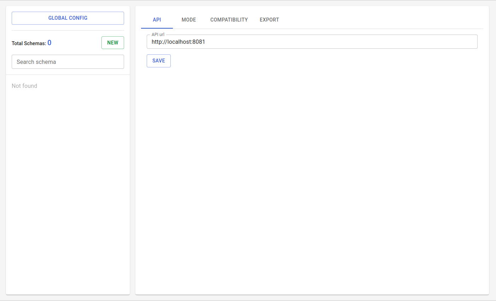

### Introduction

run:

```bash
docker run --rm -d -p <port>:80 bruqus/schema-registry-web-ui
```

for example:

```bash
docker run --rm -d -p 8111:80 bruqus/schema-registry-web-ui
```

Go to Global config -> API, set URL for Kafka REST Proxy and click 'Save'

